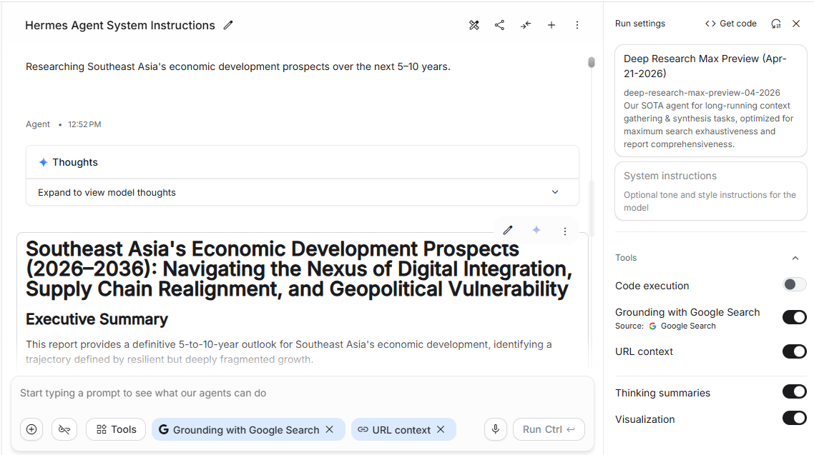
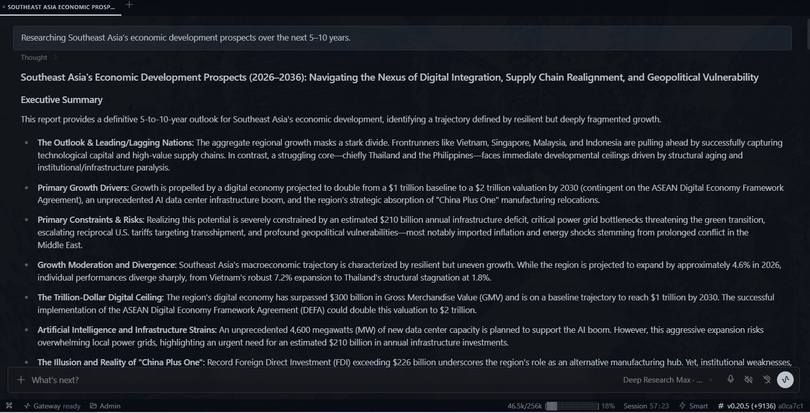

# AIstudio-reverse-engineering-to-api

**Turn your Google AI Studio session into an OpenAI-compatible API.**

No API key. No billing. No rate limits imposed by us. You sign in with your
own Google account in a real Chrome browser — this project reverse-engineered
Google AI Studio's internal web protocols and drives the page through the
Chrome DevTools Protocol (CDP), then re-exposes everything as a standard
`/v1/chat/completions` endpoint that any OpenAI-compatible client can call.

> Point any tool that speaks "OpenAI API" (Hermes, LangChain, LobeChat,
> OpenWebUI, your own scripts...) at `http://127.0.0.1:8788/v1` and use the
> same Gemini models you already use in the AI Studio web UI.

## Documentation

**Full usage guide** (setup, verification, models, media, limits, troubleshooting) —
available in the 14 languages of the VAELK ecosystem:

[English](docs/usage/en.md) ·
[Dansk](docs/usage/da.md) ·
[Deutsch](docs/usage/de.md) ·
[Español](docs/usage/es.md) ·
[Suomi](docs/usage/fi.md) ·
[Français](docs/usage/fr.md) ·
[हिन्दी](docs/usage/hi.md) ·
[Italiano](docs/usage/it.md) ·
[日本語](docs/usage/ja.md) ·
[한국어](docs/usage/ko.md) ·
[Nederlands](docs/usage/nl.md) ·
[Svenska](docs/usage/sv.md) ·
[Tiếng Việt](docs/usage/vi.md) ·
[中文](docs/usage/zh.md)

Also: [`docs/protocol-notebook.md`](docs/protocol-notebook.md) — the full
reverse-engineering notebook and per-model audit.

**Prerequisites:** a desktop OS with a display, Python 3.10+, Google Chrome, and
a Google account that can open AI Studio.

## What it can do

| Capability | Status | Notes |
|---|---|---|
| **Chat (text)** | ✅ working | `generateContent` — 14 chat models (5 free incl. Gemma, 7 pro, 2 aliases) |
| Thinking / reasoning stream | ✅ working | surfaced as `reasoning_content` (DeepSeek-style) |
| Native function calling (tools) | ✅ working | OpenAI `tools` → Gemini proto, `tool_calls` back |
| Multi-turn conversations | ✅ working | full transcript relayed per request |
| Streaming (SSE) | ✅ working | token-by-token `chat.completion.chunk` |
| **Image generation** | ✅ working | `gemini-3-pro-image` (Nano Banana Pro), `gemini-3.1-flash-image` — images returned as data-URIs in `message.media` |
| **Music generation** (Lyria) | ✅ working | `lyria-3.5`, `lyria-3-pro` — MP3 in `message.media` |
| **Text-to-speech** (TTS) | ✅ working | `gemini-3.8-flash-tts`, `gemini-3.8-flash-lite-tts` — WAV in `message.media`; optional `"voice": "Puck"` in the request body (70 voices) |
| **Deep Research agents** | ✅ working | full report + research plan + PNG artifacts + sources |
| **Antigravity agent** | ⛔ upstream-locked (09-24) | its UI now requires linking an API key; a Pro web session no longer unlocks it |
| **Omni models** | ✅ working | `gemini-omni-*` via the Interactions API |
| **Live API (voice)** | ✅ working | `gemini-3.1-flash-live` — WebChannel long-poll, PCM 24 kHz → WAV in `message.media` (E2E 09-24) |
| Veo (video) | ⛔ upstream-blocked (09-24) | `GenerateVideo` fires but the operation poll returns "entity not found" — blocked at Google's tier |

28 models are registered; 25 are callable end-to-end (verified 2026-09-24 — see §15 of the
notebook); the 3 blocked ones are marked above. Everything in the table was verified
end-to-end against the real AI Studio
runtime — captures, decoded protocol shapes and per-family notes live in
`docs/protocol-notebook.md`.

### Deep Research Max — end-to-end (screenshots)

A full `deep-research-max` run from a normal OpenAI client, using a real
research prompt ("Southeast Asia's economic development prospects over the
next 5–10 years"):

| AI Studio side (the browser this API drives) | Client side (OpenWebUI talking to `/v1`) |
|---|---|
|  |  |

What the run returned: a 53k-char report, the research plan in
`reasoning_content`, a generated PNG chart ("Singapore Dominates ASEAN FDI")
in `message.media`, and 76 cited sources in `message.sources`.

## Quick start

```bash
git clone https://github.com/gemouri/AIstudio-reverse-engineering-to-api
cd AIstudio-reverse-engineering-to-api
pip install -r requirements.txt

# 1) Launch a dedicated Chrome with CDP (its own profile — safe)
python launch_chrome.py
#    → A Chrome window opens on aistudio.google.com
#    → Sign in with YOUR Google account (first time only)

# 2) Start the API
python start.py
#    → OpenAI-compatible API at http://127.0.0.1:8788/v1
```

Try it:

```bash
# list models (with tier/protocol metadata)
curl http://127.0.0.1:8788/v1/models

# chat
curl http://127.0.0.1:8788/v1/chat/completions \
  -H "Content-Type: application/json" \
  -d '{"model":"gemini-3.1-flash-lite","messages":[{"role":"user","content":"Hello!"}]}'

# generate an image
curl http://127.0.0.1:8788/v1/chat/completions \
  -H "Content-Type: application/json" \
  -d '{"model":"gemini-3-pro-image","messages":[{"role":"user","content":"A red circle on white"}]}'
# → choices[0].message.media = ["data:image/jpeg;base64,..."]

# deep research
curl http://127.0.0.1:8788/v1/chat/completions \
  -H "Content-Type: application/json" \
  -d '{"model":"deep-research-preview","messages":[{"role":"user","content":"Compare Rust vs Zig for embedded dev"}]}'
# → message.content = report, message.reasoning_content = research plan,
#   message.media = [chart PNG], message.sources = citations
```

Use it from any OpenAI client:

```python
from openai import OpenAI
client = OpenAI(base_url="http://127.0.0.1:8788/v1", api_key="none")
print(client.chat.completions.create(
    model="gemini-3.1-flash-lite",
    messages=[{"role": "user", "content": "Hello!"}],
).choices[0].message.content)
```

## How it works (architecture)

```
OpenAI client ──HTTP──▶ Flask facade (start.py)
                          │  OpenAI ↔ Gemini proto translation
                          │  model registry + quota ledger (src/facade/registry.py)
                          ▼
                     CDP driver (src/replay/driver.py)
                          │  navigates the AI Studio tab, types your prompt,
                          │  hooks XHR to swap the target model + thinking level
                          ▼
                     Chrome (launch_chrome.py, signed into YOUR Google account)
                          ▼
                     Google AI Studio internal RPCs
                     (GenerateContent / CreateInteractionStream / bidiGenerateContent)
```

Key reverse-engineered facts (all runtime-verified, details in the notebook):

- **Model swap**: the page's XHR bodies are patched in-flight — the target
  model id and thinking level are rewritten into the internal
  `GenerateContent` payload (`p[0]` = model, `p[3][16]` = thinking config),
  so the free-tier UI host can drive any model your account can access.
- **Response taxonomy**: answers, thinking deltas, tool calls, token usage,
  inline images (`["image/jpeg", b64]`), audio (`["audio/mpeg", b64]`), and
  the Deep Research structured result frame (plan / report / artifacts /
  sources) are each decoded from Google's internal JSON-protobuf-ish shapes.
- **Protocol families**: `generateContent` (chat, image, music),
  Interactions API (omni, deep-research, antigravity), WebChannel long-poll
  (Live voice), and long-running operations (Veo video).

## Configuration (environment variables)

| Variable | Default | Meaning |
|---|---|---|
| `AIS2A_PORT` | `8788` | API port |
| `AIS2A_CDP_PORT` | `9333` | Chrome DevTools debug port |
| `AIS2A_CHROME_BIN` | auto-detected | Path to the Chrome/Chromium/Edge binary |
| `AIS2A_PROFILE_DIR` | `~/.ais2api/chrome-profile` | Dedicated browser profile |
| `AIS2A_LOCK_WAIT` | `90` | Seconds a queued request waits for the browser |
| `AIS2A_AGENT_TIMEOUT` | `1500` | Server-side timeout for agent models |
| `AIS2A_TTS_TIMEOUT` | `120` | Server-side timeout for speech models |
| `AIS2A_LIVE_TIMEOUT` | `120` | Server-side timeout for the Live voice model |
| `AIS2A_VIDEO_TIMEOUT` | `600` | Server-side timeout for video jobs |

## Model registry & quota awareness

`GET /v1/models` returns every supported model with `aistudio_tier`
(`free` / `pro` / `premium` / `agent`), `protocol`, expected `media` types, and
the attached model for agent wrappers. Free-tier models consume no paid quota;
pro, premium and agent models use the quota of the signed-in account. There is
**no local daily cap** — the server only counts requests per model per day, and
Google's own limit is the real one: its internal quota frame is mapped to an
honest HTTP 429 carrying Google's message.

## Fair use & disclaimer

This project drives the **web UI you're entitled to use** with your own
signed-in session. It is a protocol study — not affiliated with or endorsed
by Google. Respect the AI Studio terms of service, don't hammer the
endpoint, and don't use this to abuse free tiers. The ledger is there to
help you stay reasonable. Google may change these internal protocols at any
time; when they do, captures and the notebook are your map to re-reverse.

## Repository layout

```
launch_chrome.py      # dedicated Chrome launcher with CDP (sign in once)
start.py              # boots the OpenAI-compatible API
src/facade/           # Flask app + model registry (SSOT) + quota ledger
src/replay/           # CDP driver: navigate, type, hook, capture, decode
src/lib/              # response extractors (chat/thinking/tools/media/research)
tools/capture_run.py  # ground-truth capture tool (network bodies, DOM, WS)
docs/protocol-notebook.md  # the full reverse-engineering notebook
```

## License

MIT — see [LICENSE](LICENSE).
